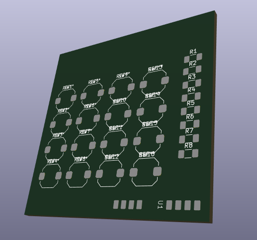
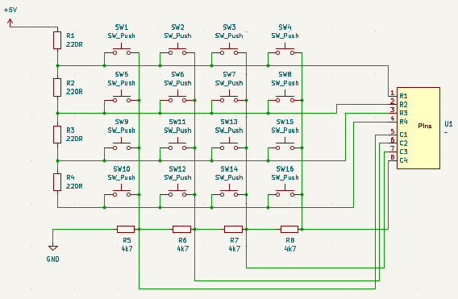

# Keypad KICAD PCB Design Practice
_Images are not necessarily correct but only detail the current progress of the work._

Steps for PCB design in KiCAD:
- Circuit schematic design **(Schematic Editor)**
  - Add element
  - Define the value (if possible)
  - Define the footprint for later PCB design **(IMPORTANT!)**
- Custom element design **(Symbol Editor)**
  - Define if input, output, etc.
- For custom element, define the footprint **(Footprint Editor)**
  - Specify the size of the pads, etc.
- For the actual PCB design **(PCB Editor)**
  - Define the board, connections, etc.

For more details, go to this link: [https://www.youtube.com/watch?v=3FGNw28xBr0](https://www.youtube.com/watch?v=3FGNw28xBr0)

## Things to learn more:
PCB connections
